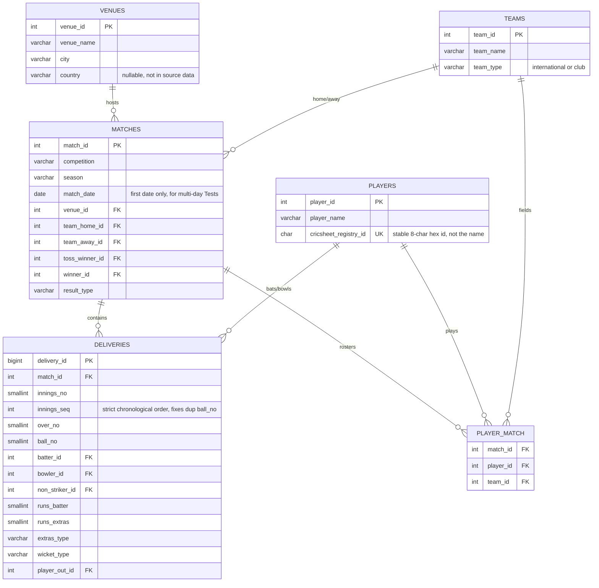
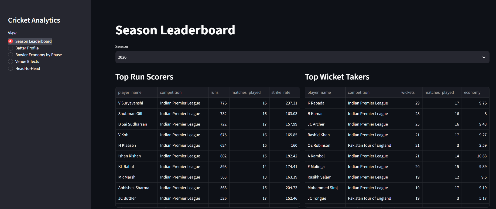

# Cricket SQL Analytics

A PostgreSQL analytics project over Cricsheet's ball-by-ball cricket data: a
hand-designed normalised schema, an idempotent Python load pipeline, 10
analytical SQL queries (window functions, CTEs, `GROUPING SETS`, an anti-join,
gaps-and-islands, and an indexed query-performance study), and a live
Streamlit dashboard.

**Live dashboard:** https://cricket-analytic.streamlit.app/

Built as the SQL-skills sprint of a larger job-search project — see the
[project brief](briefs/sql-and-analytics-project.md) for the original scope
and motivation.

## Stack

- **Database:** PostgreSQL 16, running locally in Docker for development,
  and hosted on [Neon](https://neon.tech) (free tier) for the dashboard
- **Data:** [Cricsheet](https://cricsheet.org) ball-by-ball JSON — IPL,
  Test, ODI, and T20I matches
- **Load pipeline:** Python (pandas, SQLAlchemy, psycopg2)
- **Dashboard:** Streamlit + Plotly, deployed on Streamlit Community Cloud

## Dataset scale

| Table | Rows |
|---|---:|
| teams | 131 |
| players | 9,779 |
| venues | 638 |
| matches | 11,078 |
| player_match | 244,438 |
| **deliveries** | **5,046,920** |

## Schema

Six tables, normalised, with primary/foreign key constraints. Full DDL with
rationale comments for every design decision (including two things the
Cricsheet data actually required that a naive schema design would have
missed) is in [`schema.sql`](schema.sql).



**Two real data quirks the schema had to account for** (found by inspecting
actual Cricsheet JSON files, not just documentation):

1. **Player identity uses a registry ID, not a name.** The same person can
   appear under slightly different name strings across files; Cricsheet's
   `registry.people` block maps every name variant to a stable 8-character
   hex ID, which is what `players.cricsheet_registry_id` stores and joins on.
2. **Ball numbers aren't unique within an over.** A wide or no-ball doesn't
   increment the legal ball count, so the same `(over, ball)` label can
   appear twice in the raw data (e.g. two deliveries both labelled `"0.5"`).
   `deliveries.innings_seq` — a strict 1, 2, 3... chronological counter per
   innings — is what every window function in this project orders by,
   instead of `(over_no, ball_no)`.

## Reproducing this locally

```bash
# 1. Start Postgres
docker compose up -d

# 2. Download Cricsheet data (IPL, Tests, ODIs, T20Is)
mkdir raw_data && cd raw_data
curl -O https://cricsheet.org/downloads/ipl_json.zip
curl -O https://cricsheet.org/downloads/tests_json.zip
curl -O https://cricsheet.org/downloads/odis_json.zip
curl -O https://cricsheet.org/downloads/t20s_json.zip
# unzip each into its own folder, then:
cd ..

# 3. Load the schema
docker cp schema.sql cricket_pg:/schema.sql
docker exec -it cricket_pg psql -U cricket -d cricket_db -f /schema.sql

# 4. Run the idempotent load pipeline
pip install -r requirements.txt
python load_data.py --data-dir raw_data --host localhost --port 5432 \
    --user cricket --password cricket --dbname cricket_db

# 5. (Optional) build the dashboard's summary tables and run the dashboard
docker cp summary_tables.sql cricket_pg:/summary_tables.sql
docker exec -it cricket_pg psql -U cricket -d cricket_db -f /summary_tables.sql
# set DATABASE_URL (or .streamlit/secrets.toml) to your local or hosted DB, then:
streamlit run app.py
```

## The 10 queries

All queries are in [`queries/`](queries/), each with a comment header
explaining what it answers and any non-obvious design decisions.

| # | Query | Technique |
|---|---|---|
| 1 | [Top 15 batters by career runs](queries/01_top_batters_career_runs.sql) | Multi-table join + aggregate, `DISTINCT ON` |
| 2 | [Leading run-scorer per IPL season](queries/02_season_leading_run_scorer.sql) | `RANK() OVER (PARTITION BY ...)` |
| 3 | [Season-over-season team run rate](queries/03_team_run_rate_lag.sql) | `LAG()` |
| 4 | [Batter's 10-innings moving average](queries/04_batter_moving_average.sql) | Rolling `AVG() OVER (ROWS BETWEEN ...)` |
| 5 | [Median/p90 bowler economy per season](queries/05_bowler_economy_percentiles.sql) | `PERCENTILE_CONT` |
| 6 | [Runs by season × venue × innings](queries/06_runs_grouping_sets.sql) | `GROUPING SETS` |
| 7 | [Death-overs strike rate outliers](queries/07_death_overs_outliers.sql) | CTE chain, population stddev |
| 8 | [Wicketless bowlers by season](queries/08_wicketless_bowlers_anti_join.sql) | `NOT EXISTS` anti-join |
| 9 | [Longest 50+ score streak per batter](queries/09_fifty_plus_streaks.sql) | Gaps-and-islands |
| 10 | [Index study](queries/10_index_study.sql) | `EXPLAIN ANALYZE`, composite index |

### Query 10 — the index study

Measured on the full 5,046,920-row `deliveries` table, querying V Kohli's
deliveries in the death overs (16–20):

**Before** (single-column index on `batter_id` only):
```
Bitmap Heap Scan on deliveries  (actual time=10.941..432.672 rows=4637 loops=1)
  Recheck Cond: (batter_id = 135)
  Filter: ((over_no >= 15) AND (over_no <= 19))
  Rows Removed by Filter: 38239
  Heap Blocks: exact=1678
  ->  Bitmap Index Scan on idx_deliveries_batter_id (actual time=10.266..10.266 rows=42876 loops=1)
Execution Time: 433.597 ms
```

**After** (composite index on `(batter_id, over_no)`):
```
Bitmap Heap Scan on deliveries  (actual time=1.330..3.491 rows=4637 loops=1)
  Recheck Cond: ((batter_id = 135) AND (over_no >= 15) AND (over_no <= 19))
  Heap Blocks: exact=482
  ->  Bitmap Index Scan on idx_deliveries_batter_over (actual time=1.273..1.273 rows=4637 loops=1)
Execution Time: 3.877 ms
```

**433.6ms → 3.9ms — a ~112x speedup.** The mechanism isn't "added an index
where there was none" — a single-column index on `batter_id` already
existed. The real improvement is eliminating a *post-index filtering step*:
the single-column index narrowed to 42,876 batter-matching rows, then had to
check each one against `over_no BETWEEN 15 AND 19` individually, discarding
38,239 of them. The composite index encodes both conditions directly, so
Postgres goes straight to the 4,637 rows that actually match — no filter
step, and 1,678 heap blocks read drops to 482.

## Dashboard

Reads from 6 pre-aggregated summary tables (built by
[`summary_tables.sql`](summary_tables.sql)), **not** the raw `deliveries`
table — see [Why a separate hosted data mart](#why-a-separate-hosted-data-mart)
below for why.



Five views: Season Leaderboard, Batter Profile, Bowler Economy by Phase,
Venue Effects, Head-to-Head.

### Why a separate hosted data mart

The full local database is ~814 MB. Every current free-tier managed
Postgres option is smaller than that (Neon and Supabase: 0.5 GB; Aiven:
1 GB with little headroom) — none of them can hold the raw `deliveries`
table. Rather than force it to fit, the dashboard reads from 6 small
pre-aggregated tables (~45 MB total) purpose-built for its 5 views. This
mirrors a standard real-world BI pattern: dashboards read from a data mart,
not a multi-million-row fact table, for both performance and cost reasons.
The full raw dataset, schema, and all 10 queries above still run against the
complete local database — nothing about the analysis itself is reduced.

## Known limitations and design decisions

- **`team_home_id`/`team_away_id` are positional, not literal home/away.**
  Cricsheet doesn't record true home/away; these are just `teams[0]`/`teams[1]`
  from the source data.
- **`match_date` is the first date only.** For single-day formats (IPL/ODI/T20I)
  this is exact; for multi-day Tests, it's the start date, not every day played.
- **A delivery's `wicket_type`/`player_out_id` capture only the first entry**
  in the source's wickets array. Multi-wicket deliveries (e.g. a mankad
  alongside a run out) are extremely rare and not modelled separately.
- **`batter_match_log` (dashboard) and query 9 sum runs across all innings
  in a match.** For single-innings formats this is a non-issue; for a Test
  where a batter bats twice, their two innings scores combine into one
  "match total."
- **Small-sample distortion appears repeatedly in this dataset** — an
  Associate nation's run rate swinging wildly season to season, a bowler's
  economy rate off 3 balls, an outlier's career strike rate off a handful
  of career balls. Queries 3, 5, and 7 all include minimum-sample-size
  filters for exactly this reason; the dashboard's Venue Effects view
  exposes this as an adjustable slider rather than a fixed cutoff.
- **Super Over innings are excluded** from all delivery-level aggregates
  (career runs, season leaderboards, etc.), so a Super Over performance
  never inflates a "real" batting/bowling statistic.

## Resume bullets

- Designed a normalised 6-table PostgreSQL schema for 5,046,920 ball-by-ball
  cricket deliveries; cut a core aggregation query from 433.6ms to 3.9ms
  with a composite index, verified via EXPLAIN ANALYZE.
- Wrote 10 analytical SQL queries using window functions, CTEs, and grouping
  sets to surface player and venue trends; published findings as a live
  Streamlit dashboard.
- Built an idempotent Python ingestion pipeline (pandas, SQLAlchemy) loading
  5M+ records into a hosted PostgreSQL instance.
